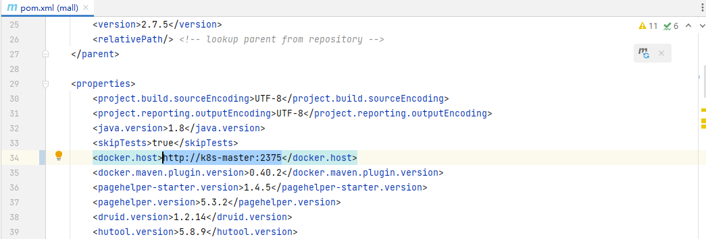

## pom.xml

### 1、插件：docker-maven-plugin

+ 修改docker.host为自己搭建的docker地址：<docker.host>http://k8s-master:2375</docker.host>，hosts文件已配置域名k8s-master

 

### 2、docker端口：2375

+ docker开放2375的方式：增加hosts的参数，如下

```shell
vim /etc/docker/daemon.json
{
  "hosts": ["tcp://0.0.0.0:2375", "unix:///var/run/docker.sock"]
}
```

```txt
"unix:///var/run/docker.sock"：unix socket，本地客户端将通过这个来连接 Docker Daemon。
"tcp://0.0.0.0:2375"：tcp socket，表示允许任何远程客户端通过 2375 端口连接 Docker Daemon。
```

+ 修改配置后，docker重新读取配置文件，并重启docker服务

```txt
systemctl daemon-reload
systemctl restart docker
```

+ 简单使用

```shell
[root@k8s-master docker]# docker -H tcp://k8s-master:2375 images
REPOSITORY                                                        TAG                 IMAGE ID            CREATED             SIZE
flannel/flannel                                                   v0.24.2             f9c73fde068f        2 months ago        76.1MB
flannel/flannel-cni-plugin                                        v1.4.0-flannel1     77c1250c26d9        2 months ago        9.87MB
registry                                                          2                   b8604a3fe854        2 years ago         26.2MB
registry.aliyuncs.com/google_containers/kube-proxy                v1.18.0             43940c34f24f        4 years ago         117MB
registry.aliyuncs.com/google_containers/kube-scheduler            v1.18.0             a31f78c7c8ce        4 years ago         95.3MB
registry.aliyuncs.com/google_containers/kube-apiserver            v1.18.0             74060cea7f70        4 years ago         173MB
registry.aliyuncs.com/google_containers/kube-controller-manager   v1.18.0             d3e55153f52f        4 years ago         162MB
registry.aliyuncs.com/google_containers/pause                     3.2                 80d28bedfe5d        4 years ago         683kB
registry.aliyuncs.com/google_containers/coredns                   1.6.7               67da37a9a360        4 years ago         43.8MB
weaveworks/scope                                                  1.12.0              4178113a354d        4 years ago         84.7MB
registry.aliyuncs.com/google_containers/etcd                      3.4.3-0             303ce5db0e90        4 years ago         288MB

```

+ 开放端口2375的网站地址：https://www.cnblogs.com/hongdada/p/11512901.html

+ 端口2375存在隐患，官方解决方案网址：https://docs.docker.com/engine/security/protect-access/


## mall在Windows环境下的部署

### MySQL

+ 版本：5.7
+ 数据库账号/密码：root/root
+ 创建数据库`mall`，导入项目`document/sql`文件夹下的`mall.sql`，初始化数据

### Redis

+ 版本：5.0.14.1

### ElasticSearch

+ 版本：7.17.3
+ 分词器版本：elasticsearch-analysis-ik（版本同7.17.3）

### Kibana

+ 版本：7.17.3

## Logstash

+ 版本：7.17.3

###  MongoDB

+ 版本：5.0.9

### RabbitMQ

+ 版本：3.10.5

### MinIO

### OSS


### 环境

| 软件        | 网址                                                |
| ----------- | --------------------------------------------------- |
| Helm        | https://helm.sh/zh/docs/intro/install/              |
| K8S集群升级 | https://cloud.tencent.com/developer/article/1849119 |

