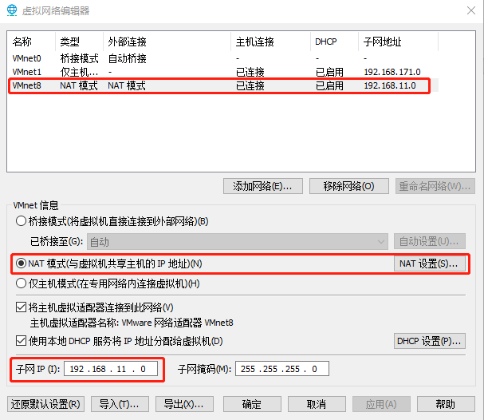
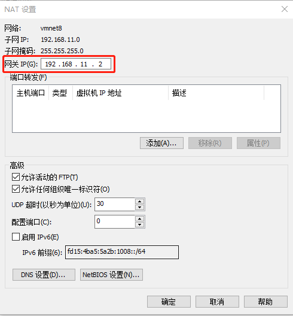
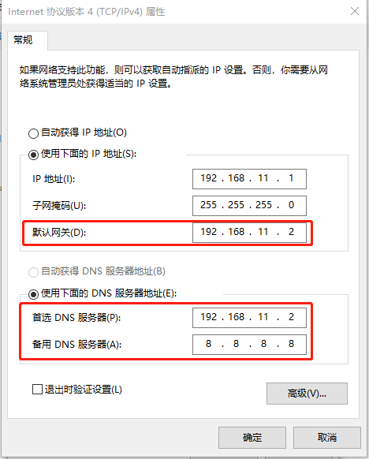

# vmvare

## 1. 虚拟机IP配置
- 查看VMware的虚拟网络编辑器，编辑->虚拟网络编辑器->VMnet8

 

 

- 查看Windows系统适配器VMware Network Adapter VMnet8的IP地址

 

- 修改Linux系统`ifcfg-ens33`文件中的IP地址、虚拟网络编辑器地址和Windows系统VM8网络IP地址相同，修改Linux虚拟机的静态IP

```shell
[root@k8s-master ~]# cat /etc/sysconfig/network-scripts/ifcfg-ens33
DEVICE=ens33
TYPE=Ethernet
ONBOOT=yes
BOOTPROTO=static
NAME="ens33"
IPADDR=192.168.11.130
PREFIX=24
GATEWAY=192.168.11.2
DNS1=192.168.11.2
```
